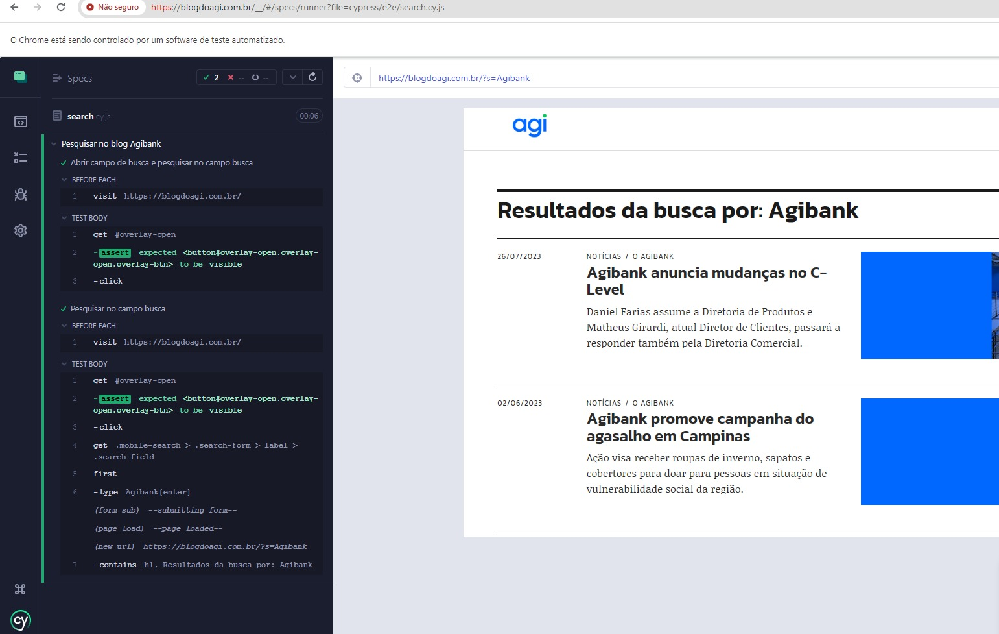

# Blog Agi - Automação WEB

[![NPM Version][npm-image]][npm-url]


WEB search automation on the Agibank blog. 




## Development setup

For the development of automation, Cypress with javascript language were used.

Dependencies

```sh
make install requires node and cypress
```

## Run test

run simple test
```sh
npx cypress open

```
run test on terminal (install allure report)
```sh
npx cypress run --env allure=true
```

<!-- Markdown link & img dfn's -->
[npm-image]: https://img.shields.io/npm/v/datadog-metrics.svg?style=flat-square
[npm-url]: https://npmjs.org/package/datadog-metrics